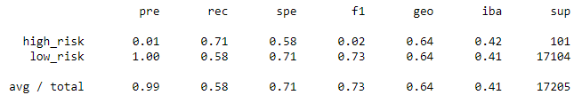
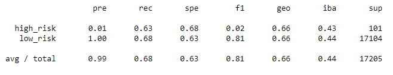
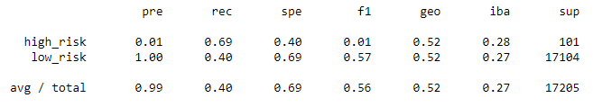
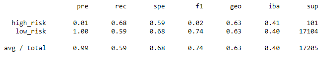
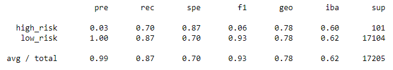
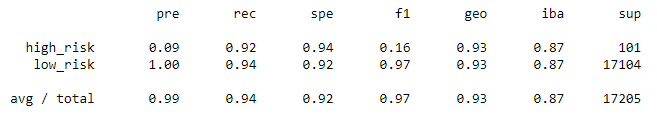

# Credit Risk Analysis

## Overview of Analysis

### Purpose

A lending services company would like to use machine learning to predict credit risk in order to make the loan process faster and more reliable, as well as more accurate which would lead to lower default rates. I will be building and evaluating several machine learning models that use various techniques to handle the unbalanced classification problem. The models will be built and evaluated using the `imbalanced-learn` and `scikit-learn` Python libraries on a credit card credit dataset from LendingClub.

## Results

### RandomOverSampler

`print(classification_report_imbalanced(y_test, y_pred))`

- Balanced accuracy score: 0.646
  - The `RandomOverSampler` model correctly predicted loan status 65% of the time.
- Precision scores: 0.01 for high_risk and 1.00 for low_risk
  - Of the loans predicted to be high risk, only 1% were actually high risk. Of the loans predicted to be low risk, 100% were actually low risk.
- Recall scores: 0.71 for high_risk and 0.58 for low_risk
  - Of the loans that were actually high risk, they were correctly predicted as such 71% of the time. Of the loans that were actually low risk, they were correctly predicted as such 58% of the time.

### SMOTE

`print(classification_report_imbalanced(y_test, y_pred))`

- Balanced accuracy score: 0.659
  - The `SMOTE` model correctly predicted loan status 66% of the time.
- Precision scores: 0.01 for high_risk and 1.00 for low_risk
  - Of the loans predicted to be high risk, only 1% were actually high risk. Of the loans predicted to be low risk, 100% were actually low risk.
- Recall scores: 0.63 for high_risk and 0.68 for low_risk
  - Of the loans that were actually high risk, they were correctly predicted as such 63% of the time. Of the loans that were actually low risk, they were correctly predicted as such 68% of the time.

### ClusterCentroids

`print(classification_report_imbalanced(y_test, y_pred))`

- Balanced accuracy score: 0.544
  - The `ClusterCentroids` model correctly predicted loan status 54% of the time.
- Precision scores: 0.01 for high_risk and 1.00 for low_risk
  - Of the loans predicted to be high risk, only 1% were actually high risk. Of the loans predicted to be low risk, 100% were actually low risk.
- Recall scores: 0.69 for high_risk and 0.40 for low_risk
  - Of the loans that were actually high risk, they were correctly predicted as such 69% of the time. Of the loans that were actually low risk, they were correctly predicted as such 40% of the time.

### SMOTEENN

`print(classification_report_imbalanced(y_test, y_pred))`

- Balanced accuracy score: 0.636
  - The `SMOTEENN` model correctly predicted loan status 64% of the time.
- Precision scores: 0.01 for high_risk and 1.00 for low_risk
  - Of the loans predicted to be high risk, only 1% were actually high risk. Of the loans predicted to be low risk, 100% were actually low risk.
- Recall scores: 0.68 for high_risk and 0.59 for low_risk
  - Of the loans that were actually high risk, they were correctly predicted as such 68% of the time. Of the loans that were actually low risk, they were correctly predicted as such 59% of the time.

### BalancedRandomForestClassifier

`print(classification_report_imbalanced(y_test, y_pred))`

- Balanced accuracy score: 0.789
  - The `BalancedRandomForestClassifier` model correctly predicted loan status 79% of the time.
- Precision scores: 0.03 for high_risk and 1.00 for low_risk
  - Of the loans predicted to be high risk, only 3% were actually high risk. Of the loans predicted to be low risk, 100% were actually low risk.
- Recall scores: 0.70 for high_risk and 0.87 for low_risk
  - Of the loans that were actually high risk, they were correctly predicted as such 70% of the time. Of the loans that were actually low risk, they were correctly predicted as such 87% of the time.

### EasyEnsembleClassifier

`print(classification_report_imbalanced(y_test, y_pred))`

- Balanced accuracy score: 0.932
  - The `EasyEnsembleClassifier` model correctly predicted loan status 93% of the time.
- Precision scores: 0.09 for high_risk and 1.00 for low_risk
  - Of the loans predicted to be high risk, only 9% were actually high risk. Of the loans predicted to be low risk, 100% were actually low risk.
- Recall scores: 0.92 for high_risk and 0.94 for low_risk
  - Of the loans that were actually high risk, they were correctly predicted as such 92% of the time. Of the loans that were actually low risk, they were correctly predicted as such 94% of the time.

## Summary

The resampling techniques overall were not very accurate, while the ensemble learners were more accurate. All models had very low precision for high risk, which means there were many false positives, while they had perfect precision for low risk. The sensitivity, or recall, of most of the models was unimpressive for both high risk and low risk, except for the `EasyEnsembleClassifier` that was above 90% for both.

### Recommendation

In this situation, high sensitivity is more important than precision since we are trying to detect high risk loans in order to lower the default rate. Of the models in this analysis, I would recommend the `EasyEnsembleClassifier` since it was the most accurate and it was highly sensitive for both high risk and low risk loans. Since it's an aggressive algorithm, there are a number of false positives which means missed opportunities on loans that are actually low risk. While this may be accepted as a cost of doing business, it would be better to find a different model that is more balanced between sensitivity and precision or have a process for manually reviewing and conditionally accepting some potentially high risk loans.
